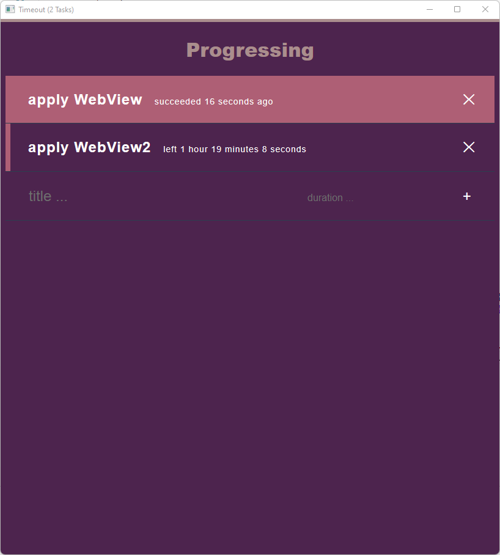

# timeout

Desktop application to display progress



## Requirements

- Rust 1.30+
- Nodejs 12.0+

## Install

clone, then process the pipeline for building using [cargo-make](https://github.com/sagiegurari/cargo-make)

```sh
cargo make build
```

## Run

```sh
cargo run
```
